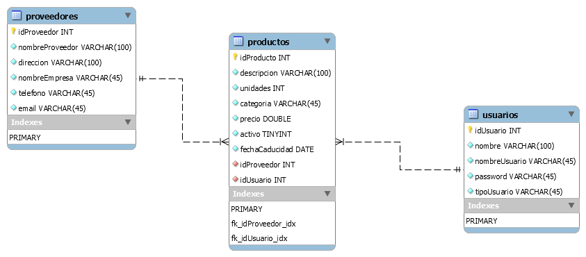
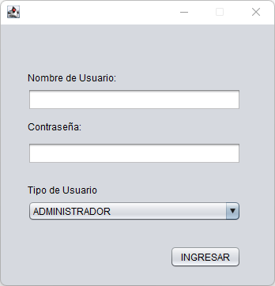
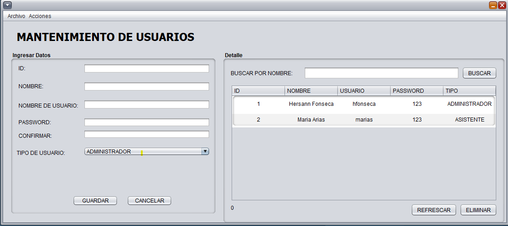
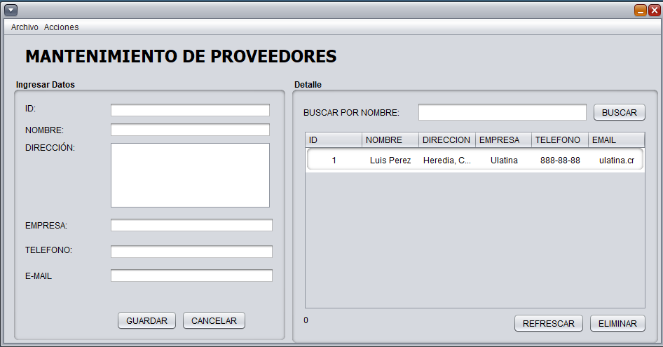
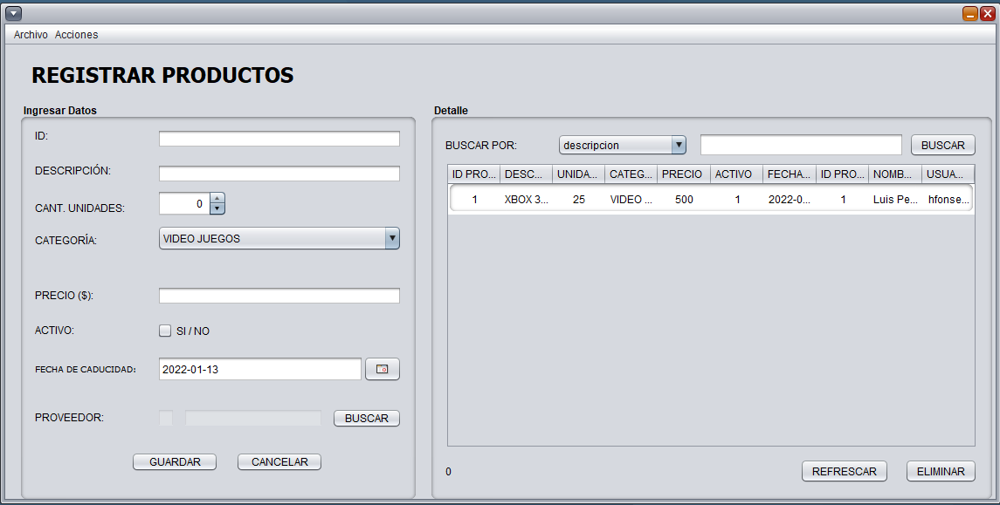
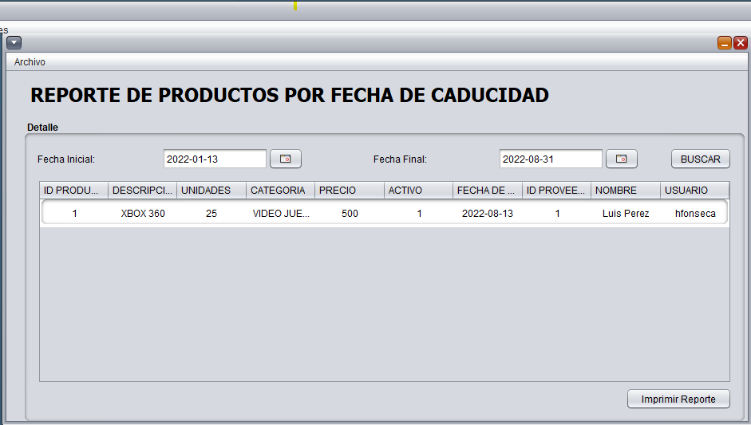

# 💼 java-crud-mysql-sis-inventario
Crud basico en java y mysql, con productos y vista con java swing,IDE: Netbeans, utilizando MVC y POO

## ✏️ Diagrama E-R 

---

## ✏️ Features
### Login

### Mantenimiento de Usuarios

### Mantenimiento de Proveedores

### Inventario de productos

### Reportes
